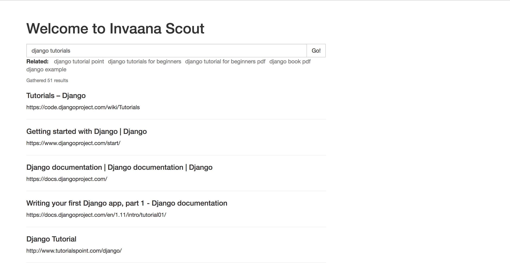

# Invaana Scout





## Usage

```python

from invaana_scout.scout import ScoutThis

scout = ScoutThis(kw="MongoDB", generate_kws=True)
scout.generated_keywords # ['learning MongoDB', 'Programming with MongoDB', 'MongoDB tutorials' ] 
scout.run() # this will gather data from all generated keywords and saves it to MongoDB

# or 

scout = ScoutThis(kw="MongoDB")
scout.run() # this will gather data and saves it to MongoDB


```

The UI server is not an integral part of the project, it's just a component that visually shows the power of 
the scout module


## Requirements

- Chrome and Chromedriver
- MongoDB


## Installation

```bash
brew install chromedriver
brew install mongodb
pip install -r requirements.txt
```


# References: 

- https://intoli.com/blog/running-selenium-with-headless-chrome/
- https://www.alexkras.com/running-chrome-and-other-browsers-in-almost-headless-mode/
- https://objectpartners.com/2017/04/13/how-to-install-and-use-headless-chrome-on-osx/